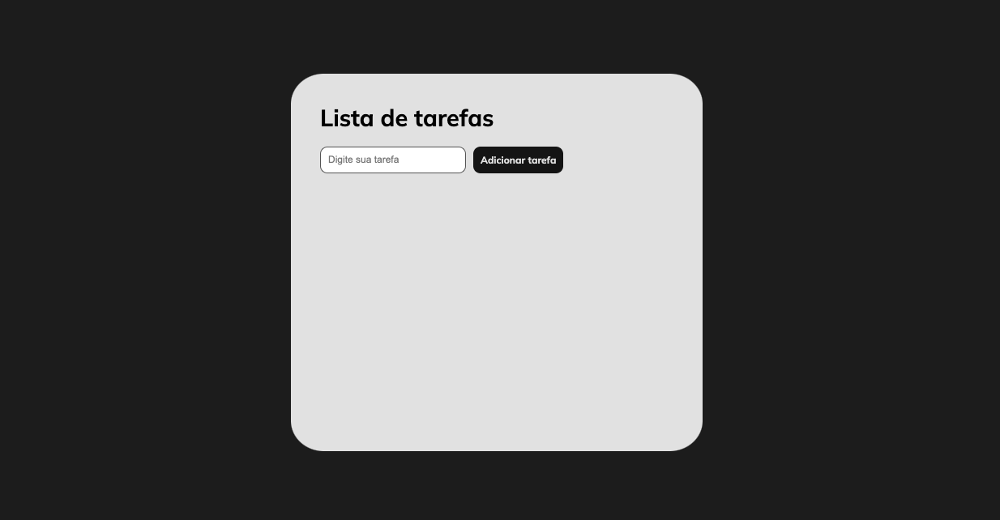

# 💻 #Lista de tarefas

[🚀 Acesse aqui](https://queiiroz.github.io/lista-de-tarefas/)

## 💻 O codigo

Exercicio do curso de JavaScript da Udemy, criação de uma lista de tarefas que possa ser
acessada novamente pelo cliente.

## 🛠 Tecnologias

- HTML
- CSS
- JavaScript
- Git
- GitHub

<table>
  <tr>
    <td>
     
    </td>
    <td>
      Feito por Gleidson Queiroz.</a> 🙋🏼‍♂️
    </td>
  </tr>
</table>
